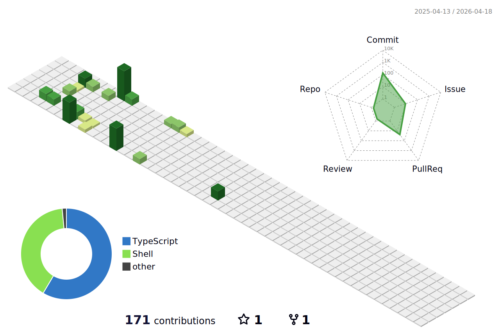

### Hi there, I'm Yuta 🤟🏻🐻

## I'm a Developer, and Designer!!

- 🌱 I’m currently learning Next.js and Three.js 🤣
- 👬🏻 I’m looking to collaborate with other content creators 👋🏻
- 🥅 2023 Goals: Learn Next.js & Three.js and some related tech and Build some products 💪🏻
- 🎮 Fun fact: I love to play video games and watching sports ⚾️

 

### :wave: Connect with me:

[//]: # ''

 
 
 
 

### :hammer_and_wrench: Languages and Tools:

 
 

### :chart_with_upwards_trend: GitHub Stats

    

 
 

### :four_leaf_clover: Contributions

 
 

### :zap: Recent Activity

<!--START_SECTION:activity-->

1. ❗ Opened issue [#46](https://github.com/Bear29ers/bear29ers.com/issues/46) in [Bear29ers/bear29ers.com](https://github.com/Bear29ers/bear29ers.com)
2. 🔒 Closed issue [#40](https://github.com/Bear29ers/bear29ers.com/issues/40) in [Bear29ers/bear29ers.com](https://github.com/Bear29ers/bear29ers.com)
3. 🎉 Merged PR [#45](https://github.com/Bear29ers/bear29ers.com/pull/45) in [Bear29ers/bear29ers.com](https://github.com/Bear29ers/bear29ers.com)
4. 💪 Opened PR [#45](https://github.com/Bear29ers/bear29ers.com/pull/45) in [Bear29ers/bear29ers.com](https://github.com/Bear29ers/bear29ers.com)
5. 🔒 Closed issue [#43](https://github.com/Bear29ers/bear29ers.com/issues/43) in [Bear29ers/bear29ers.com](https://github.com/Bear29ers/bear29ers.com)
6. 🎉 Merged PR [#44](https://github.com/Bear29ers/bear29ers.com/pull/44) in [Bear29ers/bear29ers.com](https://github.com/Bear29ers/bear29ers.com)
7. 💪 Opened PR [#44](https://github.com/Bear29ers/bear29ers.com/pull/44) in [Bear29ers/bear29ers.com](https://github.com/Bear29ers/bear29ers.com)
8. ❗ Opened issue [#43](https://github.com/Bear29ers/bear29ers.com/issues/43) in [Bear29ers/bear29ers.com](https://github.com/Bear29ers/bear29ers.com)
9. ❗ Opened issue [#42](https://github.com/Bear29ers/bear29ers.com/issues/42) in [Bear29ers/bear29ers.com](https://github.com/Bear29ers/bear29ers.com)
10. ❗ Opened issue [#41](https://github.com/Bear29ers/bear29ers.com/issues/41) in [Bear29ers/bear29ers.com](https://github.com/Bear29ers/bear29ers.com)

<!--END_SECTION:activity-->
