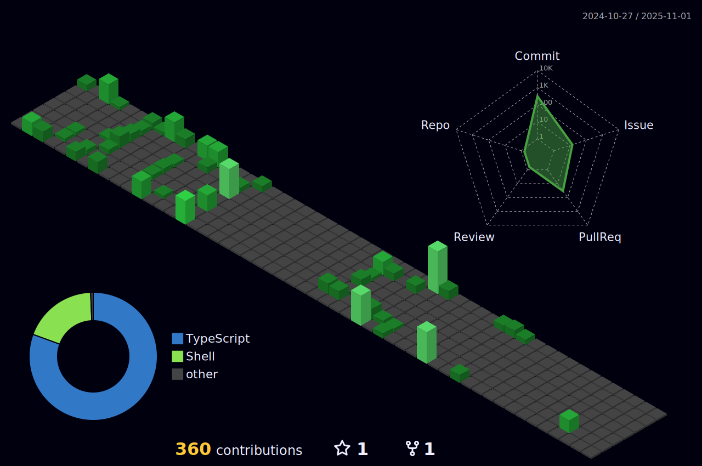

### Hi there, I'm Yuta 🤟🏻🐻

## I'm a Frontend Developer, and Designer!!

- 🌱 I’m currently learning Next.js and Three.js 🤣
- 🎮 Fun fact: I love to play video games and watching sports ⚾️
- 🏃 Stay healthy 🏋🏻

 

### :wave: Connect with me:

<!--  -->

 
 
 
 

### :hammer_and_wrench: Languages and Tools:

 
 

### :chart_with_upwards_trend: GitHub Stats

    

 
 

### :four_leaf_clover: Contributions

 
 

### :zap: Recent Activity

<!--START_SECTION:activity-->

1. 🎉 Merged PR [#33](https://github.com/Bear29ers/dotfiles/pull/33) in [Bear29ers/dotfiles](https://github.com/Bear29ers/dotfiles)
2. 💪 Opened PR [#33](https://github.com/Bear29ers/dotfiles/pull/33) in [Bear29ers/dotfiles](https://github.com/Bear29ers/dotfiles)
3. 🎉 Merged PR [#32](https://github.com/Bear29ers/dotfiles/pull/32) in [Bear29ers/dotfiles](https://github.com/Bear29ers/dotfiles)
4. 💪 Opened PR [#32](https://github.com/Bear29ers/dotfiles/pull/32) in [Bear29ers/dotfiles](https://github.com/Bear29ers/dotfiles)
5. 🎉 Merged PR [#31](https://github.com/Bear29ers/dotfiles/pull/31) in [Bear29ers/dotfiles](https://github.com/Bear29ers/dotfiles)
6. 💪 Opened PR [#31](https://github.com/Bear29ers/dotfiles/pull/31) in [Bear29ers/dotfiles](https://github.com/Bear29ers/dotfiles)
7. 🎉 Merged PR [#30](https://github.com/Bear29ers/dotfiles/pull/30) in [Bear29ers/dotfiles](https://github.com/Bear29ers/dotfiles)
8. 💪 Opened PR [#30](https://github.com/Bear29ers/dotfiles/pull/30) in [Bear29ers/dotfiles](https://github.com/Bear29ers/dotfiles)
9. 🚀 Published release [v20250120](https://github.com/Bear29ers/bear29ers.com/releases/tag/v20250120) in [Bear29ers/bear29ers.com](https://github.com/Bear29ers/bear29ers.com)
10. 🎉 Merged PR [#183](https://github.com/Bear29ers/bear29ers.com/pull/183) in [Bear29ers/bear29ers.com](https://github.com/Bear29ers/bear29ers.com)

<!--END_SECTION:activity-->
