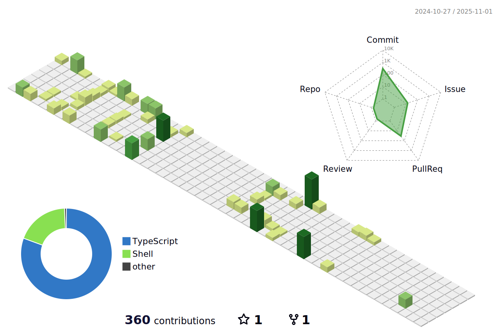

### Hi there, I'm Yuta 🤟🏻🐻

## I'm a Developer, and Designer!!

- 🌱 I’m currently learning Next.js and Three.js 🤣
- 👬🏻 I’m looking to collaborate with other content creators 👋🏻
- 🥅 2023 Goals: Learn Next.js & Three.js and some related tech and Build some products 💪🏻
- 🎮 Fun fact: I love to play video games and watching sports ⚾️

 

### :wave: Connect with me:

[//]: # ''

 
 
 
 

### :hammer_and_wrench: Languages and Tools:

 
 

### :chart_with_upwards_trend: GitHub Stats

    
    

 
 

### :four_leaf_clover: Contributions

 
 

### :zap: Recent Activity

<!--START_SECTION:activity-->

1. ❗ Opened issue [#19](https://github.com/Bear29ers/bear29ers.com/issues/19) in [Bear29ers/bear29ers.com](https://github.com/Bear29ers/bear29ers.com)
2. ❗ Opened issue [#18](https://github.com/Bear29ers/bear29ers.com/issues/18) in [Bear29ers/bear29ers.com](https://github.com/Bear29ers/bear29ers.com)
3. ❗ Opened issue [#17](https://github.com/Bear29ers/bear29ers.com/issues/17) in [Bear29ers/bear29ers.com](https://github.com/Bear29ers/bear29ers.com)
4. 🔒 Closed issue [#7](https://github.com/Bear29ers/bear29ers.com/issues/7) in [Bear29ers/bear29ers.com](https://github.com/Bear29ers/bear29ers.com)
5. 🎉 Merged PR [#16](https://github.com/Bear29ers/bear29ers.com/pull/16) in [Bear29ers/bear29ers.com](https://github.com/Bear29ers/bear29ers.com)
6. 🗣 Commented on [#1610](https://github.com/jose-elias-alvarez/null-ls.nvim/issues/1610) in [jose-elias-alvarez/null-ls.nvim](https://github.com/jose-elias-alvarez/null-ls.nvim)
7. 💪 Opened PR [#16](https://github.com/Bear29ers/bear29ers.com/pull/16) in [Bear29ers/bear29ers.com](https://github.com/Bear29ers/bear29ers.com)
8. 🔒 Closed issue [#5](https://github.com/Bear29ers/bear29ers.com/issues/5) in [Bear29ers/bear29ers.com](https://github.com/Bear29ers/bear29ers.com)
9. 🎉 Merged PR [#15](https://github.com/Bear29ers/bear29ers.com/pull/15) in [Bear29ers/bear29ers.com](https://github.com/Bear29ers/bear29ers.com)
10. 💪 Opened PR [#15](https://github.com/Bear29ers/bear29ers.com/pull/15) in [Bear29ers/bear29ers.com](https://github.com/Bear29ers/bear29ers.com)

<!--END_SECTION:activity-->
